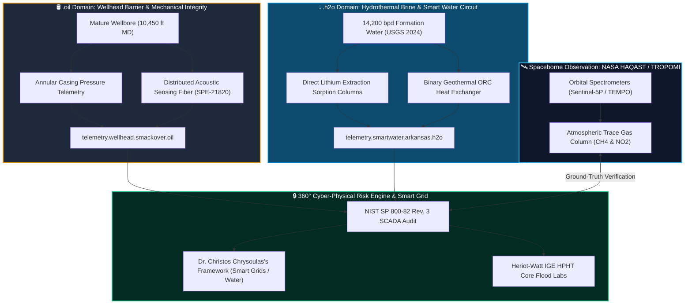

# Doctoral Research Dossier: Subsurface GeoEnergy Systems & OT Telemetry

[](https://github.com/healthearthack/Research/actions/workflows/agent_ci.yml)
[](https://github.com/healthearthack/Research/actions/workflows/junior_researcher.yml)
[](https://www.hw.ac.uk/)
[](https://www.hw.ac.uk/go-global/)
[](LICENSE.md)

[](http://localhost:8000)

> ### أهلاً وسهلاً، اسمي آندي | Ahlan wa Sahlan, Ismi Andy
> **"Uniting Subsurface GeoEnergy Systems, Industrial OT Cybersecurity, and Transatlantic Clean Energy Diplomacy across Heriot-Watt Dubai & Edinburgh."**  
> *Atmospheric Scientist • U.S. Department of Defense Project GO Arabic Scholar (Morocco) • Air Force ROTC Alumnus • Energy, EngD Candidate (App ID: 9535a9e2)*

**Doctor of Engineering in Energy (`Energy, EngD`) | January 2027 Intake**  
**Host Department:** Institute of GeoEnergy Engineering (IGE) & School of Mathematical and Computer Sciences (MACS)  
**Heriot-Watt University:** Dubai Campus (Regional Telemetry & OT Operations) & Edinburgh Campus (HPHT Laboratory Validation)  
**Applicant:** Andrew C. Kieckhefer (`andy.kieckhefer@gmail.com`)  
**Application ID:** `9535a9e2-53ab-f111-8a75-06f0a7fb396f`

---

## 🌐 Active Locally Hosted TLD Portals (`website.oil:8000` & `website.h2o:8001`)

This research dossier operates two live local web portals running with active SCADA telemetry and **Open Research Requisitions ("Help Wanted")**:

| Domain Portal | Local Host Address | Scope & Requisitions ("Help Wanted") | Status |
| :--- | :--- | :--- | :--- |
| 🛢️ **website.oil:8000** | [**`http://localhost:8000`**](http://localhost:8000) | **Subsurface Barrier & Mechanical Integrity**<br>• Casing Pressure ($842.1\text{ psi}$) & DAS Strain ($1.45\text{ kHz}$)<br>• **OIL-01:** OT Threat & SCADA Telemetry Lead<br>• **OIL-02:** Wellbore Geomechanics & Casing Specialist<br>• **OIL-03:** Satellite Methane Remote Sensing Analyst | 🟢 **ONLINE** |
| 💧 **website.h2o:8001** | [**`http://localhost:8001`**](http://localhost:8001) | **Hydrothermal Brine & Smart Water Circuit**<br>• $14,200\text{ bpd}$ Brine, $385\text{ ppm Li}$, $850\text{ kW}$ Geothermal<br>• **H2O-01:** DLE Chemical Process Engineer<br>• **H2O-02:** Smart Water SCADA & Reinjection Lead<br>• **H2O-03:** Geothermal Binary ORC Engineer | 🟢 **ONLINE** |

**Run / Restart Locally:**
```bash
python serve_domains.py
```

---

## 🎯 Executive Research Vision
This repository houses the living, version-controlled doctoral research framework for converting mature petroleum wellbores into co-production systems for **battery-grade lithium (Direct Lithium Extraction - DLE)** and **low-enthalpy geothermal energy**, safeguarded by a continuous **360-degree operational technology (OT) cyber-physical risk engine**.



---

## 🔬 Supervisory Alignment & Academic Lineage

### 1. Primary Supervisor Alignment: Dr. Christos Chrysoulas
* **Core Domains:** Smart Grids, Smart Water Management Systems, Internet of Things (IoT), and Cyber-Physical Systems.
* **Research Intersection:** Repurposing wellhead infrastructure requires real-time closed-loop control of pressurized brine flow and grid synchronization. This project integrates Dr. Chrysoulas's research on smart grid data architectures and explainable AI for IoT attack detection into upstream energy operations (NIST SP 800-82 Rev. 3 & CISA ICS directives).

### 2. Space-to-Subsurface Lineage: Dr. Tracey Holloway & NASA HAQAST
* **Lineage Anchor:** Department of Atmospheric & Oceanic Sciences (AOS) and the Nelson Institute for Environmental Studies at the **University of Wisconsin–Madison**.
* **Methodological Bridge:** Coupling sub-surface fluid kinetics with orbital remote sensing. Incorporating spaceborne telemetry from **TROPOMI** (TROPOspheric Monitoring Instrument) and TEMPO (developed under the NASA Health and Air Quality Applied Sciences Team - HAQAST led by Dr. Tracey Holloway) to independently verify the environmental zero-emissions integrity of repurposed geothermal wellbore networks.

---

## ⚡ Operational AI Telemetry Agent (`agent/`)
This repository includes an operational, test-validated Python AI agent ([`agent/`](agent/)) that ingests wellhead SCADA streams, audits physical and cyber-physical thresholds, and synthesizes executive diagnostic briefs:

* **Multi-LLM Reasoning Engine:** Supports **Claude** (via Anthropic API), **Google Gemini** (via `google-genai`), or an **Autonomous Offline Deterministic Mode** (zero API key required).
* **One-Click Local Execution:**
  ```bash
  python run_agent.py
  ```
* **Sample Telemetry:** Evaluates real-world reservoir and surface parameters from Smackover Formation DLE pilots ([`data/sample_wellhead_stream.json`](data/sample_wellhead_stream.json)).
* **Latest Diagnostic Brief:** Generated output archived at [`radar/latest_telemetry_diagnostic.md`](radar/latest_telemetry_diagnostic.md).

---

## 🌐 The `.oil` and `.h2o` Dual-Domain Architecture
Grounded in our [Statement of Purpose](proposal/statement_of_purpose.md) and [Extended Proposal](docs/Supporting_Doc_1_Extended_Proposal_and_Timeline.md), this research formalizes two distinct digital twin namespaces:
* 🛢️ **`.oil` Domain (`wellbore.smackover.oil`):** Subsurface wellbore mechanical barrier integrity, annular casing pressures, cement acoustic impedance, and P&A liability mitigation.
* 💧 **`.h2o` Domain (`telemetry.smartwater.arkansas.h2o`):** Hydrothermal brine throughput, DLE sorption column kinetics, geothermal heat exchange, and reinjection hydraulic balancing under Dr. Chrysoulas's Smart Water paradigm.
* 📄 Full Architecture Specification: **[`docs/domain_architecture_oil_and_h2o.md`](docs/domain_architecture_oil_and_h2o.md)**

---

## 🤖 Autonomous "Junior Researcher" Policy & Threat Radar
A scheduled CI/CD agent ([`.github/workflows/junior_researcher.yml`](.github/workflows/junior_researcher.yml)) autonomously tracks international energy law, federal incentives, and operational technology threat vectors:
* **Weekly Schedule:** Runs every Monday at 06:00 UTC (or on-demand via `workflow_dispatch`).
* **Live Feed:** Results are synthesized autonomously into markdown briefs inside [`radar/`](radar/):
  * 📡 **[Latest Intelligence Brief](radar/latest_intelligence_brief.md)**
  * 🗄️ **[Weekly Digest Archive](radar/weekly_digests/)**

---

## 📚 Core Application Dossier & Repository Structure

| Document / Module | Description | Location |
| :--- | :--- | :--- |
| **Statement of Purpose** | Concise narrative bridging AFROTC leadership, UW–Madison AOS, and doctoral candidacy | [`proposal/statement_of_purpose.md`](proposal/statement_of_purpose.md) |
| **Supporting Document 1** | Extended scientific methodology, 3.5-year Gantt milestone schedule, and Heriot-Watt lab allocations | [`docs/Supporting_Doc_1_Extended_Proposal_and_Timeline.md`](docs/Supporting_Doc_1_Extended_Proposal_and_Timeline.md) |
| **Supporting Document 2** | Academic CV, formal Letter of Intent, UW–Madison transcript audit, and UK/UAE compliance audit | [`docs/Supporting_Doc_2_Academic_Dossier_and_Compliance_Audit.md`](docs/Supporting_Doc_2_Academic_Dossier_and_Compliance_Audit.md) |
| **Dual-Domain Specification**| Grounding the `.oil` and `.h2o` digital twin TLD architecture in established research | [`docs/domain_architecture_oil_and_h2o.md`](docs/domain_architecture_oil_and_h2o.md) |
| **Entity & Ecosystem Architecture** | 4-Pillar governance linking LLC incubation, Heriot-Watt doctoral host, UW–Madison AOS, and advocacy | [`docs/commercial_and_entity_architecture.md`](docs/commercial_and_entity_architecture.md) |
| **Annotated Bibliography** | 8-part foundational literature review (USGS 2024, DOE, Kumar DLE, NIST SP 800-82r3, SPE-21820) | [`references/annotated_bibliography.md`](references/annotated_bibliography.md) |
| **BibTeX Citations** | Standardized LaTeX / Zotero citation library | [`references/references.bib`](references/references.bib) |
| **Post-Doctoral Target Lines** | Modular career launchpad & bridge dossiers (The Holloway Group, Heriot-Watt, NOAA, Shell) | [`career/README.md`](career/README.md) |
| **Career Opportunity Index** | Comparative matrix of target roles, funding vehicles, and leverage points across all folders | [`career/index.md`](career/index.md) |
| **The Research Workbench** | "The Tools to Make the Engine": digital twin testbeds, SCADA evaluators, and radar | [`tools/README.md`](tools/README.md) |
| **Social Impact & Advocacy** | Transatlantic MENA energy diplomacy, de-stigmatization, and Caregivers in Science | [`advocacy/README.md`](advocacy/README.md) |
| **Funding & Financial Engines** | Strategic resourcing portfolio (James Watt Scholarship, UKRI, UAE Consortia, NSF, Caregivers to PhD) | [`funding/README.md`](funding/README.md) |
| **Research Forecast & Roadmap** | 3.5-Year operational chronicle, 4 W's matrix (Who, Where, When, What), and story narrative | [`forecast/README.md`](forecast/README.md) |
| **Telemetry Diagnostic Brief** | Real-time diagnostic briefing produced by the autonomous Python agent | [`radar/latest_telemetry_diagnostic.md`](radar/latest_telemetry_diagnostic.md) |

---

## 📜 Intellectual Property & Licensing
* **Research Text, Proposals, and Academic Documentation:** Licensed under [Creative Commons Attribution-NonCommercial-NoDerivatives 4.0 International (CC BY-NC-ND 4.0)](LICENSE.md).
* **Automation Software, Scraping Pipelines, and Code:** Licensed under the [MIT License](LICENSE.md).  
* **Copyright:** © 2026 Andrew C. Kieckhefer. All rights reserved.