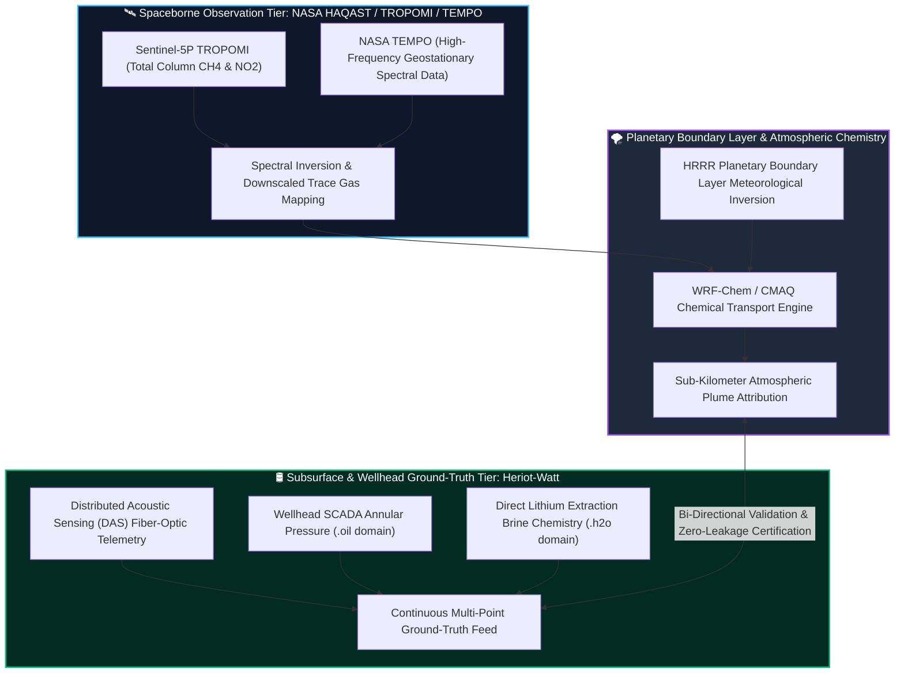

# 🌉 Bridge Prospectus: Space-to-Subsurface Telemetry

**Document Type:** Strategic Academic Bridge & Joint Research Prospectus  
**Target Group:** The Holloway Group, University of Wisconsin–Madison (Nelson Institute / AOS)  
**Principal Investigator:** Dr. Tracey Holloway (NASA HAQAST Team Lead)  
**Author:** Andrew C. Kieckhefer (Doctoral Candidate, Heriot-Watt University; B.A. UW–Madison AOS)  
**Core Domain:** Satellite Ground-Truthing, Fugitive Methane Containment & GeoEnergy System Verification  

---

## 1. The Scientific Problem & The Missing Link
Under U.S. Inflation Reduction Act (IRA Section 45X and 30D) and global net-zero frameworks, critical mineral production (such as Direct Lithium Extraction - DLE) and baseload geothermal energy receive federal subsidies only if they verify strict environmental containment. 

While mature petroleum basins (e.g., the Smackover Formation, Permian Basin, Gulf Coast) contain immense reserves of lithium-rich brine and geothermal enthalpy, **a major scientific verification gap persists**:
* **Top-of-Atmosphere (Orbital Observation):** Satellite spectrometers—principally **TROPOMI** (onboard ESA's Sentinel-5P) and NASA's geostationary **TEMPO** (Tropospheric Emissions: Monitoring of Pollution)—measure total column trace gas densities (methane $\text{CH}_4$, nitrogen dioxide $\text{NO}_2$, sulfur dioxide $\text{SO}_2$, and formaldehyde $\text{HCHO}$).
* **Bottom-of-Well (Subsurface Geomechanics & OT):** Upstream operators record high-frequency thermodynamic and mechanical states via wellhead SCADA sensors, Distributed Acoustic Sensing (DAS), and downhole pressure/temperature gauges.
* **The Gap:** Atmospheric observation models routinely struggle with **sub-kilometer source attribution and ground-truth validation** in dense legacy oil and gas fields, while subsurface engineers lack the atmospheric chemistry transport models required to prove that repurposed wellbore operations are not releasing fugitive plumes into the planetary boundary layer.

---

## 2. The Mutual Value Proposition (Why This Is An Equal Partnership)
This bridge does **not** represent a passive employment inquiry; it is a structured, mutually advantageous research collaboration uniting two tier-one engineering strengths:

### What Heriot-Watt & Andrew Bring to The Holloway Group:
1. **Direct Empirical Wellbore Data:** Subsurface fluid kinematics, flow rates, and high-pressure high-temperature (HPHT) brine chemistry data from Heriot-Watt's laboratory and Middle Eastern field research.
2. **Ground-Truth Telemetry Network:** Direct access to operational wellhead acoustic strain (DAS) and continuous pressure/temperature telemetry that can independently corroborate satellite plume detections.
3. **Engineering-to-Policy Translation:** Experience with industrial operational technology (OT) cyber-physical controls and federal energy policy (CISA, DOE, BLM, IRS 45X).

### What The Holloway Group Provides to the Energy Transition:
1. **Global Satellite Ingestion & Modeling Authority:** World-class expertise in translating spaceborne spectral data into actionable atmospheric concentration models.
2. **NASA HAQAST Leadership:** Established infrastructure for delivering satellite-derived environmental intelligence directly to federal, state, and industrial decision-makers.
3. **Madison Institutional Pedigree:** Leveraging the university's legendary legacy in satellite meteorology (the Suomi legacy) to create the gold-standard verification pipeline for repurposed energy infrastructure.

---

## 3. Joint Work Packages (Postdoctoral Research Blueprint)

### Work Package 1: Satellite Downscaling for Legacy Wellfield Micro-Plumes
* **Objective:** Downscale regional TROPOMI and TEMPO column methane observations over high-density repurposed wellbore pilots in the Smackover and Permian basins to 100-meter resolution using high-resolution boundary-layer meteorology.
* **Deliverable:** Open-source Python library integrating NASA Earthdata APIs with subsurface wellhead spatial databases.

### Work Package 2: Real-Time Wellhead Anomaly Correlation
* **Objective:** Cross-correlate sudden pressure drops or acoustic frequency anomalies detected by downhole fiber-optic DAS with transient orbital methane enhancements.
* **Deliverable:** A probabilistic Bayesian machine learning model that distinguishes between operational surface venting, downhole casing leaks, and ambient background biogenic emissions.

### Work Package 3: Joint Grant Proposal & Policy White Paper
* **Objective:** Co-author a landmark interdisciplinary research paper submitted to *Nature Energy* or *Environmental Science & Technology*, followed by a joint grant application (e.g., NASA Applied Sciences / DOE Geothermal Technologies Office).

---

## 4. Engagement Timeline: From Candidacy to Collaboration
* **Doctoral Year 1–2 (Dubai):** Andrew develops the core OT telemetry and geomechanics foundation; publishes baseline thermodynamic and sensor papers.
* **Doctoral Year 3 (Edinburgh):** Andrew executes HPHT laboratory testing; reaches out to The Holloway Group with preliminary empirical datasets and a formal presentation outline for the AMS or AGU annual conference.
* **Doctoral Year 4 (Pre-Viva):** Joint submission of postdoctoral fellowship proposals (NASA Postdoctoral Program / NSF Earth Sciences Postdoctoral Fellowship) to fund Andrew’s appointment at UW–Madison.
