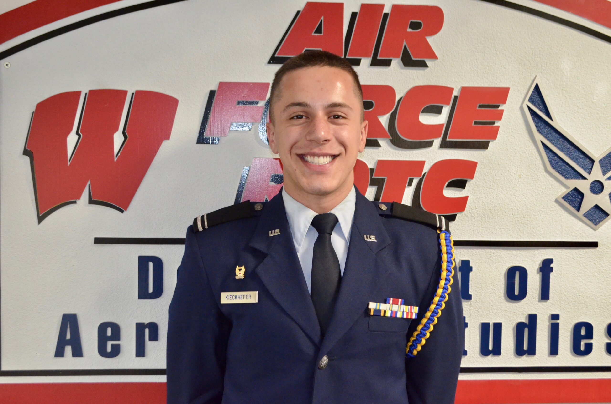

# 🎖️ Archival Verification: Capt. Jeff Hill Legacy Fund Scholarship (2017)

**Document Reference:** `docs/assets/README.md`  
**Awardee:** Cadet Andy Kieckhefer  
**Awarding Body:** [The Jeff Hill Legacy Fund](https://jeffhilllegacyfund.org/recipients/)  
**Institutional Unit:** Air Force ROTC Detachment 925, Department of Aerospace Studies, University of Wisconsin–Madison  
**Award Amount:** $2,000 USD  
**Award Year:** 2017  
**Verification Asset:** [`2017-Andy-Kieckhefer-Jeff-Hill-Award.jpg`](2017-Andy-Kieckhefer-Jeff-Hill-Award.jpg)  

---

## 📸 Verified Archival Image & Official Registry Citation

### Official Web Registry Description
* **Foundation Website:** `https://jeffhilllegacyfund.org/recipients/`
* **Original HTML Image Title:** `title="Andy Kieckhefer – U of WI $2,000"`
* **Official Registry Caption:**
  > **Cadet Andy Kieckhefer**  
  > University of Wisconsin  
  > **$2,000**

* **Source Image URL:** `https://jeffhilllegacyfund.org/wp-content/uploads/2021/09/2017-Andy-Kieckhefer-2000-scaled.jpg`

---

## 🛡️ Academic Context & Ethical Framing
This record documents an **undergraduate competitive merit scholarship** awarded during academic study at the University of Wisconsin–Madison:
* **The Mission:** The Capt. Jeff Hill Legacy Fund honors the memory of Capt. Jeff Hill (UW–Madison AFROTC alumnus and C-17 pilot who fell in the 2010 Yukon 27 mission at Elmendorf AFB) by providing educational support to exceptional AFROTC cadets.
* **Selection Rigor:** Awarded by a competitive selection board evaluating cadet character, academic resilience, and leadership potential.
* **Ethical Transparency:** Accurately cited strictly as an undergraduate cadet award and academic merit scholarship.
