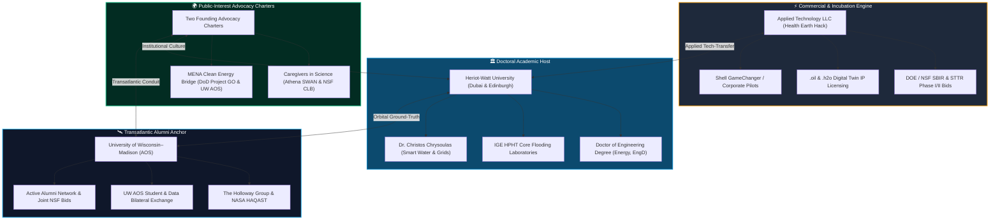

# 🏢 Commercial, Academic & Entity Architecture

**Master Operating Framework & Ecosystem Governance**  
**Repository Anchor:** [`healthearthack/Research`](https://github.com/healthearthack/Research)  
**Applied Research Director & Doctoral Candidate:** Andrew C. Kieckhefer (`andy.kieckhefer@gmail.com`)  
**Doctoral Track:** `Energy, EngD` — Institute of GeoEnergy Engineering (IGE) & School of Mathematical and Computer Sciences (MACS), Heriot-Watt University  

---

## 🧭 Executive Overview: Beyond the Solo Student Paradigm

Major global engineering challenges—such as repurposing mature petroleum wellbores into battery-grade Direct Lithium Extraction (DLE) and low-enthalpy geothermal hubs—cannot be resolved within an isolated, purely academic silo. 

Following the organizational models of world-class academic directors (such as Dr. Tracey Holloway’s integration of **The Holloway Group**, **NASA HAQAST**, and **ESWN**), this research dossier operationalizes a **4-pillar institutional ecosystem**:

---

## 1. Pillar I: The Commercial LLC Engine (`Health Earth Hack LLC`)

Traditional university spin-outs often stall due to protracted technology-transfer negotiations and multi-year licensing delays. Operating an active, agile **LLC** provides immediate structural advantages:

* **Industrial Sponsor for EngD:** The Doctor of Engineering (`Energy, EngD`) is intrinsically an industry-anchored degree requiring an enterprise partner. The candidate's LLC functions as the agile testbed and commercial deployment sponsor for proprietary digital twin software.
* **Federal SBIR/STTR Commercialization Track:** Enables direct applications to the **U.S. Department of Energy (DOE) SBIR Topic 14 (Geothermal & Mineral Co-Production)** and **NSF SBIR (Artificial Intelligence & Energy Systems)**, bypassing university overhead limits.
* **IP Custody for `.oil` and `.h2o` Namespaces:** Houses the operational proprietary code, SCADA parsing modules, and edge-computing models ([`serve_domains.py`](../serve_domains.py) and [`agent/`](../agent/)).
* **Corporate Venture Agility:** Structured to receive non-dilutive seed-stage innovation capital directly from corporate venture funds (e.g., **Shell GameChanger**, **SLB Ventures**).

---

## 2. Pillar II: The Academic Doctoral Host (Heriot-Watt University)

Heriot-Watt University serves as the empirical scientific anchor and degree-granting institution:
* **Academic Lineage:** Institute of GeoEnergy Engineering (IGE) and the School of Mathematical and Computer Sciences (MACS).
* **Dual-Campus Mobility Strategy:**
  * **Years 1–2 (Dubai Campus):** Embeds the candidate within Gulf clean energy R&D (ADEK, ADNOC, Masdar), field SCADA deployments, and Dr. Chrysoulas’s Smart Grids research group.
  * **Years 3–4 (Edinburgh Campus):** Executes physical core flooding and autoclave testing in Edinburgh's world-leading High-Pressure High-Temperature (HPHT) reservoir laboratories.
* **Supervisory Leadership:** Mentorship by **Dr. Christos Chrysoulas**, anchoring the candidate's telemetry models into formal Smart Water Management Systems and explainable AI for industrial IoT security.

---

## 3. Pillar III: Transatlantic Alumni Anchor (UW–Madison AOS)

Rather than severing ties with undergraduate roots, this research leverages active status as an alumnus of the **Department of Atmospheric and Oceanic Sciences (AOS) at the University of Wisconsin–Madison**:
* **The Holloway Group Nexus:** Establishing an ongoing data exchange with **Dr. Tracey Holloway** (Team Lead, NASA HAQAST) to ground-truth spaceborne trace-gas spectrometers (**TROPOMI** and **TEMPO**) with bottom-of-well Distributed Acoustic Sensing (DAS) and wellhead casing telemetry.
* **Transatlantic Student Bilateral Pipeline:** Connecting UW–Madison AOS undergraduate and graduate students with Heriot-Watt Dubai research seminars and UAE field telemetry datasets.
* **Joint NSF Bids:** Partnering UW–Madison and Heriot-Watt faculty on transatlantic **NSF International Research Networks (OISE)** and **Earth Sciences Postdoctoral Fellowships (EAR-PF)**.

---

## 4. Pillar IV: The Two Founding Advocacy Charters

Two dedicated, active social advocacy engines ensure that computational advancement advances human equity and international collaboration:

1. [**Caregivers in Science (CIS)**](../advocacy/caregivers-in-science.md):
   * **Dual Institutional Anchor:** Formally co-anchored to **Heriot-Watt University’s Athena SWAN Gender Equity Charter** and the **National Science Foundation (NSF) Career-Life Balance (CLB)** initiative.
   * **Core Mission:** Eliminates the "maternal and caregiving wall" in physical sciences by virtualizing laboratory access through digital twins, supporting researchers caring for children or elderly parents managing chronic cardiovascular illness.
2. [**The Transatlantic MENA Clean Energy Bridge**](../advocacy/middle-eastern-populations.md):
   * **Founding Bridge:** Formally co-anchored to the **U.S. Department of Defense Project GO (Global Officer)** Arabic scholarship and the **UW–Madison Atmospheric & Oceanic Sciences (AOS) Alumni Network**.
   * **Core Mission:** Dismantles reductive Western media tropes by channeling Gulf clean-tech sovereign capital and carbonate reservoir expertise into American energy basins (Smackover DLE) via a direct student/data exchange between UW–Madison and Heriot-Watt Dubai.
