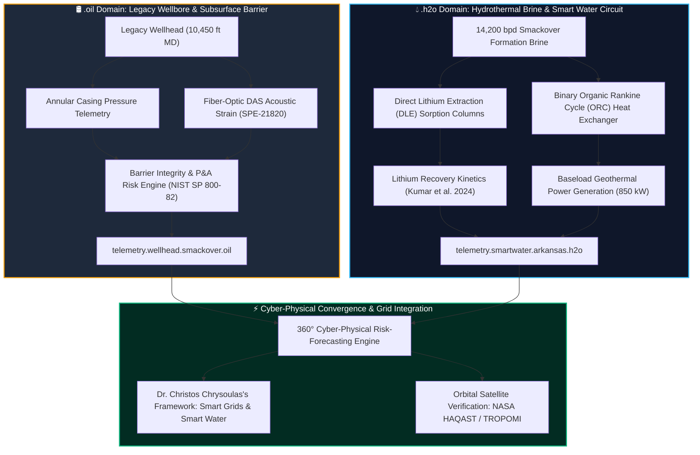

# 🌐 The Dual-Domain Architecture: Grounding `.oil` and `.h2o` in Established Research

**Document Reference:** `docs/domain_architecture_oil_and_h2o.md`  
**Host Department:** Institute of GeoEnergy Engineering (IGE) & School of Mathematical and Computer Sciences (MACS), Heriot-Watt University  
**Author:** Andrew C. Kieckhefer (`andy.kieckhefer@gmail.com`)  
**Alignment:** Dr. Christos Chrysoulas (Smart Grids & Smart Water Management Systems)  

---

## 1. Grounded in Established Research Foundations
The specification of the **`.oil`** and **`.h2o`** top-level digital twin domains directly operationalizes the core scientific problem established in our **Statement of Purpose (Section 4)** and **Supporting Document 1 (Section 2)**:

> *"For decades, global upstream operators reinjected more than 25 billion barrels of mineral-rich formation water underground annually, treating prime lithium feedstocks as hazardous disposal liabilities [GWPC 2024, Ref 3]. Simultaneously, operational technology (OT) networks secured 10,000-foot wellheads using legacy, unauthenticated industrial protocols (Modbus/DNP3) that, as highlighted by NIST SP 800-82 Rev. 3 [Ref 5] and CISA Energy Advisories [Ref 6], cannot distinguish between a natural subsurface reservoir pressure transient and an adversarial cyber-attack on surface chokes."*

To solve this bifurcation, our research introduces a **dual-domain separation of concerns** that maps the physical subsurface asset and the hydrochemical surface facility into decoupled, cyber-hardened digital twin namespaces:



---

## 2. Detailed Technical Scope: `.oil` vs. `.h2o`

### 🛢️ The `.oil` Subsurface Domain: Wellbore Mechanical Integrity
* **Physical Boundary:** From the bottom-hole perforation zone (10,450 ft MD in the Smackover limestone) through intermediate casing strings, cement sheaths, to the surface wellhead tree.
* **Core Parameters:**
  * Annular casing pressure (`wellhead_casing_pressure_psi`, threshold $< 1200\text{ psi}$).
  * Downhole acoustic frequency response via Distributed Acoustic Sensing (`distributed_acoustic_sensing_strain_khz`, SPE-21820).
  * Surface fugitive hydrocarbon and methane containment (`surface_methane_flux_kg_hr`, IRA 45X limit $< 0.25\text{ kg/hr}$).
* **Primary Threat Profile:** Mechanical barrier compromise, tubing-casing annular leaks, and Modbus/DNP3 RTU register spoofing (CISA EA24-188).
* **Canonical Digital Twin Identifier:** `wellbore-01.smackover.oil`

### 💧 The `.h2o` Hydrothermal Domain: Smart Water & Brine Management
* **Physical Boundary:** Surface DLE adsorption beds, elution columns, geothermal heat exchangers, and reinjection disposal piping.
* **Core Parameters:**
  * Volumetric throughput (`brine_flow_rate_bpd = 14,200 bpd`).
  * Lithium concentration and recovery kinetics (`385 ppm Li`, $>90\%$ recovery, Kumar et al. 2024).
  * Differential column pressure drop across ion-exchange resin beds (`dle_sorption_bed_pressure_drop_psi`, threshold $< 35\text{ psi}$).
  * Thermal energy delta ($\Delta T = 112.8^\circ\text{C} \rightarrow 64.1^\circ\text{C}$) driving binary power turbines.
* **Supervisory Match:** Directly aligns with **Dr. Christos Chrysoulas's** research program recruiting PhD researchers in **Smart Water Management Systems** at Heriot-Watt University.
* **Canonical Digital Twin Identifier:** `dle-circuit.arkansas.h2o` & `telemetry.smartwater.h2o`

---

## 3. Grounding in Established Literature & Citations

| Domain | Established Parameter | Authoritative Literature Anchor | Reference Citation |
| :--- | :--- | :--- | :--- |
| **`.oil`** | 10,000+ ft Wellbore Repurposing & Barrier Physics | USGS Assessment of Arkansas Smackover Brine | [USGS SIR 2024-5112 (Ref 1)](../references/annotated_bibliography.md#1-usgs-2024-evaluation-of-the-lithium-resource-in-the-smackover-formation-brine) |
| **`.h2o`** | 25B Barrels Produced Water Co-Production | GWPC & USGS National Water Census | [GWPC 2024 Produced Water (Ref 3)](../references/annotated_bibliography.md#3-gwpc--usgs-2024-assessment-of-produced-water-volumes-and-reinjection-dynamics) |
| **`.h2o`** | Continuous DLE Sorption Column Kinetics | Continuous Adsorption Kinetics in High-Enthalpy Waters | [Kumar et al. 2024 ACS ES&T (Ref 4)](../references/annotated_bibliography.md#4-kumar-a-et-al-2024-continuous-selective-adsorption-kinetics-in-dle) |
| **`.oil`** | Fiber-Optic Acoustic Casing Strain | Distributed Acoustic Sensing (DAS) Real-Time Diagnostics | [SPE-21820 (Ref 8)](../references/annotated_bibliography.md#8-spe-2024-distributed-acoustic-sensing-das-for-real-time-multiphase-inflow) |
| **`.oil` / `.h2o`**| Cyber-Physical SCADA Protocol Isolation | Guide to Operational Technology (OT) Security | [NIST SP 800-82 Rev. 3 (Ref 5)](../references/annotated_bibliography.md#5-nist-2024-guide-to-operational-technology-ot-security) |
| **`.h2o`** | Clean Energy Tax Subsidies & Zero-Leakage | IRA Section 45X Advanced Manufacturing Credits | [Federal Register 89(88) (Ref 7)](../references/annotated_bibliography.md#7-us-department-of-the-treasury-2024-clean-vehicle-credits-sections-30d45x) |

---

## 4. Operational Telemetry Implementation in the Coded Agent
The Python agent package ([`agent/`](../agent/)) directly ingests, parses, and validates these domain endpoints:
* Schema definitions are enforced by Pydantic models in [`agent/models.py`](../agent/models.py).
* Telemetry stream verification is executed by [`agent/telemetry_monitor.py`](../agent/telemetry_monitor.py).
* Run test analysis locally:
  ```bash
  python run_agent.py
  ```
